# Alpha-Defect Detection in Hot-Rolled Steel Coils

**Author:** Gurjas Singh Gandhi

A machine-learning pipeline and a Streamlit web app that predict whether a
hot-rolled steel coil carries an **Alpha defect**, using the process parameters
recorded across every rolling stage.

---

## Table of contents

1. [Problem statement](#problem-statement)
2. [Dataset](#dataset)
3. [Project structure](#project-structure)
4. [Methodology](#methodology)
5. [Results](#results)
6. [Running locally](#running-locally)
7. [Using the Streamlit app](#using-the-streamlit-app)
8. [Deploying to Streamlit Community Cloud](#deploying-to-streamlit-community-cloud)
9. [Limitations and next steps](#limitations-and-next-steps)
10. [License](#license)

---

## Problem statement

In hot rolling mills, the Alpha defect is a critical quality problem. It
**cannot be detected inline**, because the coil is under tension in the
inspection zones. Quality control today relies on sampling at the final
stage, where only a fraction of coils are inspected. Manual inspection is also
slow compared with the tight time constraints of production and supply chain.

Alpha defects are a very small share of production, but each missed one can
lead to customer complaints and downgrades. Every rolling stage has process
parameters that may contribute to the defect, so the model has to look at all
stages together.

**Goal:** flag Alpha defects from process data so that proactive action can be
taken before the coil reaches the customer.

**Acceptance criterion** from the problem statement:

| Metric | Target |
|---|---|
| Recall | 100% (zero false negatives) |
| Precision | > 90% (fewer than 10% false positives) |

Submissions are a CSV of shape 339 x 2 with columns `CoilID` and `Y`,
saved as `expected_submission.csv`.

---

## Dataset

| File | Shape | Contents |
|---|---|---|
| `dataset/train.csv` | 1352 x 51 | `CoilID`, `X1`-`X49`, target `Y` |
| `dataset/test.csv` | 339 x 50 | `CoilID`, `X1`-`X49` |
| `dataset/sample_submission.csv` | 339 x 2 | Submission template |

| Column | Description |
|---|---|
| `CoilID` | Unique identifier for each coil |
| `X1`-`X49` | Anonymised process parameters across multiple rolling stages |
| `Y` | Alpha defect occurrence (1 = defect, 0 = no defect) |

Key characteristics:

- **Severe class imbalance:** 66 defects out of 1352 coils (4.88%), a ratio of roughly 1:19.
- **Missing values:** 249 missing cells across 12 columns in train, and 68 in test.
- **Skewed features:** 6 parameters have |skewness| > 2, with large differences in scale between columns.

---

## Project structure

```
Defect_Coil_Detection/
├── dataset/
│   ├── train.csv               # labelled training coils
│   ├── test.csv                # unlabelled test coils
│   └── sample_submission.csv   # submission template
├── models/
│   └── defect_model.joblib     # trained ensemble used by the app (created by train.py)
├── .streamlit/
│   └── config.toml             # Streamlit theme and upload limit
├── pipeline.py                 # shared preprocessing + feature engineering
├── defect_detection.py         # full analysis: EDA, CV ensemble, threshold sweep, submission
├── train.py                    # trains the ensemble and saves models/defect_model.joblib
├── app.py                      # Streamlit app: upload a CSV, get predictions
├── expected_submission.csv     # predictions for test.csv
├── requirements.txt
└── LICENSE
```

`pipeline.py` is the single source of truth for how raw parameters become
model features. `defect_detection.py`, `train.py` and `app.py` all import from
it, so training and live predictions always transform data the same way.

---

## Methodology

```mermaid
flowchart LR
    raw["Raw X1..X49"] --> impute["Median imputation"]
    impute --> clip["Clip to 1st-99th percentile"]
    clip --> fe["Feature engineering"]
    fe --> iso["Isolation Forest anomaly score (fit on normal coils)"]
    iso --> ens["LightGBM + XGBoost + CatBoost"]
    ens --> avg["Average probability"]
    avg --> thr["Threshold tuned for 100% recall"]
    thr --> out["Defect / Normal"]
```



### 1. Preprocessing

- **Median imputation.** The median is robust to the heavy-tailed parameters.
- **Outlier clipping.** Each parameter is clipped to its training 1st-99th
  percentile range, so extreme sensor readings don't dominate the tree splits.
  The clip bounds are stored with the model and applied to new data unchanged.

### 2. Feature engineering (`pipeline.engineer_features`)

This step adds 32 features on top of the 49 raw parameters. The Isolation
Forest score below adds one more, for 82 model inputs in total:

| Group | Features | Why |
|---|---|---|
| Row aggregates | mean, std, min, max, range, IQR, median, skew, kurtosis | Overall profile of each coil's process trace |
| Stage statistics | mean / std / max for each of 5 stages | The defect can come from any stage |
| Cross-stage interactions | stage-to-stage mean differences, stage 1 / stage 5 ratio | Captures abnormal transitions between stages |
| Spike / crash counts | parameters more than 2 std above or below the mean, and their ratio | Sudden deviations in the process |

The stages are X1-X10, X11-X20, X21-X30, X31-X40 and X41-X49.

### 3. Anomaly signal

An **Isolation Forest** (400 trees) is fit **only on normal coils**. Its
anomaly score, `iso_anomaly`, becomes an extra feature: coils that don't look
like normal production get a higher score, even when their pattern is
different from the defects seen in training.

### 4. Ensemble model

Three gradient-boosting models are trained and their probabilities averaged:

| Model | Imbalance handling | Key settings |
|---|---|---|
| LightGBM | `class_weight = {0: 1, 1: 40}` | 700 trees, lr 0.015, depth 5 |
| XGBoost | `scale_pos_weight = 40` | 700 trees, lr 0.015, depth 5 |
| CatBoost | `class_weights = {0: 1, 1: 40}` | 700 iterations, lr 0.015, depth 5 |

Performance is estimated with **stratified 5-fold cross-validation**, so every
training coil gets an out-of-fold (OOF) probability from models that never
saw it.

### 5. Threshold optimisation

Because missing a defect is far more costly than a false alarm, the decision
threshold is **not** 0.5. The pipeline sweeps thresholds from 0.001 to 0.6 on
the OOF probabilities and picks the **highest-precision threshold that still
keeps recall at 100%**.

---

## Results

Out-of-fold results on the 1352 training coils, from `python train.py`:

| Metric | Value |
|---|---|
| ROC-AUC | 0.878 (0.79 to 0.97 across folds) |
| Selected threshold | 0.0035 |
| Recall | **100%** (66 / 66 defects caught, FN = 0) |
| Precision | 7.1% (TP = 66, FP = 861) |
| True negatives | 425 |

On the test set, `defect_detection.py` flags 272 of 339 coils (it uses the
fold-averaged models). The app's full-data model flags 232 of 339 at the
trained threshold.

**Interpretation.** The zero-false-negative requirement is met, but precision
is far below the 90% target. A few defective coils are statistically very
close to normal coils, so the threshold has to drop very low to catch all of
them, and that flags many normal coils too. In practice this model works as a
**screening filter**: it clears about a third of coils as safe with no missed
defects, and sends the rest to inspection. The threshold slider in the app
shows the recall/precision trade-off live.

---

## Running locally

Requires **Python 3.12** (3.10 or later should work).

```bash
git clone https://github.com/Gurjas2112/Defect_Coil_Detection.git
cd Defect_Coil_Detection

python -m venv .venv
# Windows
.venv\Scripts\activate
# macOS / Linux
source .venv/bin/activate

pip install -r requirements.txt
```

| Command | What it does |
|---|---|
| `python defect_detection.py` | Full analysis: EDA printout, 5-fold ensemble, threshold sweep, writes `expected_submission.csv` |
| `python train.py` | Trains the ensemble and saves `models/defect_model.joblib` for the app (takes about 1 minute) |
| `streamlit run app.py` | Starts the web app at http://localhost:8501 |

A trained `models/defect_model.joblib` is already committed, so you can run the
app straight away. Only rerun `train.py` if you change the data or the model.

---

## Using the Streamlit app

1. Open the app (locally, or at the deployed URL).
2. If you don't have data, click **Download a sample CSV** to get 20 coils from the test set.
3. **Upload a CSV.** Requirements:
   - It must contain numeric columns `X1` to `X49`. Extra columns are ignored.
   - `CoilID` is optional. If present, it is carried through to the output.
   - Blank cells are allowed and are filled with the training medians.
4. Read the results:
   - **Defect probability:** the ensemble's averaged probability (0 to 1).
   - **Prediction:** `Defect` if the probability is at or above the threshold, otherwise `Normal`. The `Y` column gives the same result as 1 / 0.
   - Summary counts and a histogram of the probabilities.
5. **Adjust the threshold** in the sidebar. The sidebar shows the recall,
   precision, missed defects and false alarms you would get at that threshold
   on validation data. **Reset to trained threshold** restores the 100%-recall setting.
6. Click **Download predictions (CSV)** to save the results.

If the file is missing required columns or has non-numeric values, the app
lists exactly what is wrong instead of failing.

---

## Deploying to Streamlit Community Cloud

1. Push this repository to GitHub, including `models/defect_model.joblib`.
2. Sign in at [share.streamlit.io](https://share.streamlit.io) with GitHub.
3. Click **Create app** and choose **Deploy a public app from GitHub**.
4. Set:
   - **Repository:** `Gurjas2112/Defect_Coil_Detection`
   - **Branch:** `main`
   - **Main file path:** `app.py`
   - **Advanced settings, Python version:** 3.12
5. Click **Deploy**. Streamlit installs `requirements.txt` and serves the app at
   a public `*.streamlit.app` URL that anyone can open.

Pushing a new commit to `main` redeploys the app automatically.

---

## Limitations and next steps

- **Precision is well below target.** Ideas for improving it:
  - Reduce leakage in validation by fitting the imputer, clip bounds and
    Isolation Forest inside each fold.
  - Try more anomaly models (one-class SVM, local outlier factor, PCA
    reconstruction error) as extra features.
  - Calibrate probabilities (isotonic regression) before choosing the threshold.
  - Use feature selection and interaction features on the most important parameters.
  - Use repeated CV so the threshold choice is more stable.
- **Small positive class.** With only 66 defects, the metrics vary a lot between folds (ROC-AUC from 0.79 to 0.97).
- **Anonymised features.** Without domain meaning for `X1`-`X49`, the stage grouping is assumed from the column order.

---

## License

Released under the terms of the [LICENSE](LICENSE) file in this repository.
